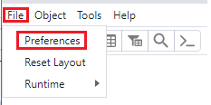
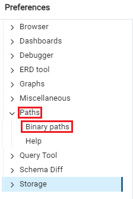
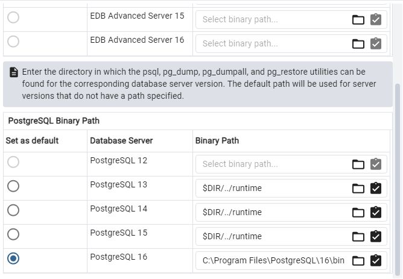

Configurando o pgAdmin

Primeiramente é preciso passar para o pgAdmin o path da pasta "bin" do PostgreSQL. Para isso siga os seguintes passos:
- Na aba superior, selecione File > Preferences.

- Na janela Preferences, selecione Path > Binary Path.

- Na página Binary Path, desça a página e verifique a versão do PostgreSQL selecionada, é recomendado que se use a versão mais recente.

- O campo "Binary Path" deve estar com a string "$DIR/../runtime", para passar o path para o pgAdmin selecione o ícone de pasta da opção selecionada e passe o caminho para a pasta "bin" no seu computador. Só é necessário passar o path para a versão que você vai usar.
